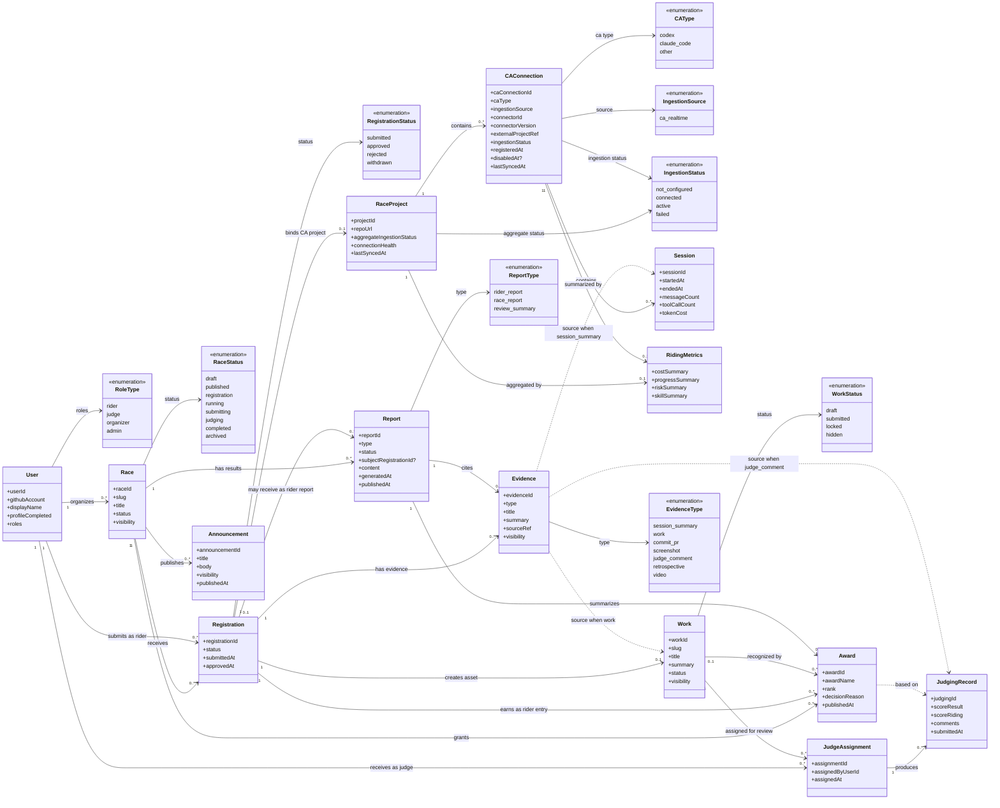
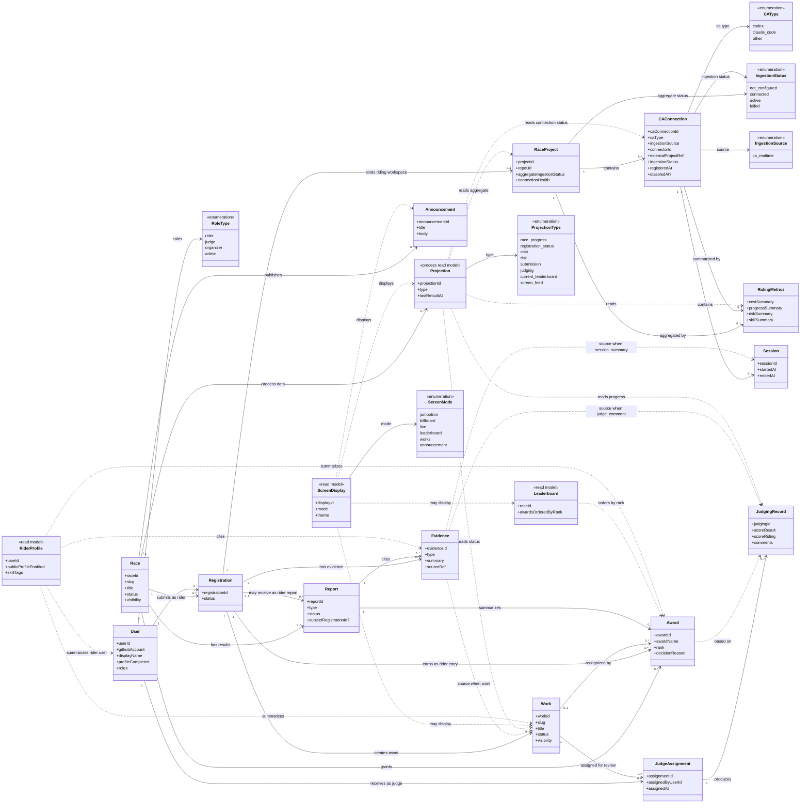

# ARY Domain Analysis v0.3

基线状态：

* 2026-06-13 冻结为 ARY MVP 领域基线。
* 后续聚合边界、领域事件、数据模型草案应以本版本为输入。

来源文档：

* `ary-mvp.prd.md`
* `ary-mvp.ia.md`

高优先级修正来源：

* 2026-06-13 用户对领域概念的直接校正。该意见优先级高于 PRD 和 IA。

本文从以下步骤沉淀当前领域基线：

1. 从 PRD / IA 抽取候选领域名词。
2. 将候选概念初步分为核心实体、值对象、过程对象、投影对象、外部系统。
3. 用 UML Class Diagram 表达核心领域模型和完整概念关系。
4. 明确 MVP 领域边界与不变量。

本阶段不做数据库设计，不决定表结构，也不决定代码类名。目标是先在概念层对齐。

MVP 关键约束：

* MVP 只支持个人参赛，不支持 Team。
* ARY MVP 使用 GitHub 账号登录；登录后用户补充个人信息，成为 ARY User。
* User 持有 `roles` 集合，可以同时拥有 `rider`、`judge`、`organizer`、`admin` 中的多个身份。MVP 不把角色分配建模为独立实体。
* Score Rubric 暂不进入当前领域模型，后续再细化。

---

# 1. 候选领域名词

## 1.1 核心业务对象

这些词描述 ARY 最核心的业务世界。

| 概念 | 中文名 | 初步含义 |
|---|---|---|
| Race | 赛事 | ARY 的核心内容对象，一场 Agent Racing 活动 |
| Challenge / Challenge Brief | 赛题 / 赛题摘要 | Race 要解决的问题或任务描述 |
| User / Account | 用户 / 账号 | 通过 GitHub 登录后补充个人信息形成的 ARY 用户 |
| User Roles | 用户身份集合 | User 持有的 rider、judge、organizer、admin 身份集合 |
| Rider | 骑手 / 参赛者 | 拥有 rider role 的 User |
| Registration | 报名记录 | 拥有 rider role 的 User 对某场 Race 的个人参赛申请 |
| Race Project | 参赛项目 / 骑行工作区 | 一个 User 参加一场 Race 时对应的一个骑行工作区，下面可以接入多个 CAConnection |
| CA Connection | CA 接入登记 / 实例 | RaceProject 下的单个 CA / connector / 外部 CA Project 登记与运行接入实例 |
| Session | 会话 | 某个 CAConnection 下的一次 User 与 CA 协同过程 |
| Work | 作品资产 | User 在 Race 中提交并沉淀下来的公开或待公开资产，不是单纯提交记录 |
| Judge | 评委 | 拥有 judge role 的 User |
| Judging Record | 评审记录 | 基于 Judge Assignment 产生的评分和评语；评委与作品从分配关系追溯 |
| Award | 奖项结果 | 由奖项名称和名次构成，授予某个 Registration，可选关联 Work；榜单按 Award 名次排列 |
| Leaderboard | 榜单 | 按名次排列的 Award 展示集合 |
| Evidence | 证据 | 支撑骑行能力评价的材料；Session Summary 和 Work 都属于 Evidence |
| Report | 报告 / 赛事结果 | 评审后形成的赛事结果与总结，不是过程投影 |
| Rider Profile | 骑手档案 | 拥有 rider role 的 User 的参赛、作品、获奖和能力证据沉淀 |

## 1.2 骑行与 CA 数据对象

这些词描述 ARY 区别于普通 Hackathon 平台的核心能力。

| 概念 | 中文名 | 初步含义 |
|---|---|---|
| CA | Coding Agent | 选手使用的智能编程代理或工具 |
| CA Type | CA 类型 | Codex、Claude Code 等来源类型 |
| CA Data Ingestion | CA 数据接入 | 将一个 RaceProject 下一个或多个 CAConnection 的实时 CA Session 接入 ARY；GitHub Repo 只作为作品代码入口或 Evidence 外部材料引用 |
| Race Project | 参赛项目 / 骑行工作区 | 一个 User 在一场 Race 中的骑行工作区，是多个 CAConnection 的容器 |
| CA Connection | CA 接入登记 / 实例 | RaceProject 下的单个 CA / connector / 外部 CA Project 登记与运行接入实例，可包含多个 Sessions |
| Session | 会话 | CAConnection 下的一次 CA 协同工作记录；一个 CAConnection 可以有多个 Sessions |
| Project Creation | 项目生成 | Registration approved 后由 ARY 幂等生成一个 RaceProject；RaceProject 下可配置多个 CAConnection，可关联 GitHub Repo 作为作品代码材料入口 |
| Ingestion Source | 接入来源 | 实时 CA 接入来源；GitHub Repo 不作为 CA 接入来源，只作为代码材料或 Evidence sourceRef |
| Session Summary | 会话摘要 | 从实时接入 Session 生成的骑行过程摘要，是 Evidence 的一种；MVP 不接受事后手动上传补交 |
| Riding Metrics | 骑行指标 | 成本、进度、风险、能力等指标 |
| Cost Metrics | 成本指标 | token 消耗、估算成本、单位产出成本等 |
| Progress Metrics | 进度指标 | 启动时间、活跃时长、阶段完成度等 |
| Risk Metrics | 风险指标 | 长时间无进展、临近截止未提交、频繁失败等 |
| Riding Skill Metrics | 骑行能力指标 | 规划、拆解、验证、纠偏、复盘等能力判断 |
| Riding Skill Tag | 骑行能力标签 | 最终沉淀到 Rider Profile 或报告里的能力标签 |
| Milestone | 里程碑 | 骑行过程中的关键进展节点 |
| Riding Event | 骑行事件 | 开始 Session、完成里程碑、提交作品、成本异常等事件 |

## 1.3 展示与传播对象

这些词描述公开端、Gallery 和大屏。

| 概念 | 中文名 | 初步含义 |
|---|---|---|
| Race Gallery | 赛事画廊 / 首页 | 公开端首页，以赛事资产为主体 |
| Featured Race / Featured Races | 主推赛事 | 首页首屏展示的核心 Race 集合；MVP 首场可只有一场，但信息架构必须支持多场 |
| Live Hall | 实况大厅 | 展示进行中赛事状态和事件流的公开页面 |
| Event Stream | 事件流 | Live Hall 中展示的关键赛事动态 |
| Current Leaderboard | 当前榜单 | 比赛进行中或阶段性的过程榜单展示，属于实时读取模型，不是最终 Award 排名 |
| Works | 作品列表 | 某场 Race 的公开作品集合 |
| Work Page | 作品详情页 | 作品资产、案例资产和评审资产的公开承载页 |
| Results | 赛果页 | Race 结束后的榜单和奖项展示 |
| Review | 评审总结页 | Race 结束后的评审总结和复盘 |
| Featured Works | 精选作品 | 首页或赛后传播中重点展示的作品 |
| Featured Riders | 优秀骑手 | 首页或赛后传播中重点展示的 Rider |
| Past Races | 往届赛事 | 已结束 Race 的公开沉淀 |
| Cooperation | 介绍与合作页 | 解释 ARY 并承接报名、办赛、赞助、合作 |
| CTA | 行动入口 | 报名、查看赛题、进入实况、查看赛果等入口 |
| Screen Console | 大屏控制台 | 控制现场、课堂、直播大屏展示 |
| Jumbotron | 主大屏视图 | 大屏展示模式之一，偏现场主视觉 |
| Billboard | 信息看板视图 | 大屏展示模式之一，偏榜单、公告、状态信息 |
| Screen View / Display View | 大屏展示视图 | 大屏实际播放或投放的内容视图 |
| Announcement | 公告 | 主办方在 Live Hall 或大屏发布的信息 |

## 1.4 Console 与角色对象

这些词描述管理端，但其中一部分是“角色”，不一定都是领域实体。

| 概念 | 中文名 | 初步含义 |
|---|---|---|
| Race Console | 赛事控制台 | MVP 的办赛、参赛、评审统一入口 |
| Organizer View | 主办方视图 | Race Console 中面向主办方的视图 |
| Rider View | 选手视图 | Race Console 中面向选手的视图 |
| Judge View | 评委视图 | Race Console 中面向评委的视图 |
| Organizer | 主办方 | 被 Admin 分配 organizer 身份的 User；MVP 不引入 Organization |
| Admin | 管理员 | 可以分配 User 身份并进行必要系统管理的 User |
| Screen Operator | 大屏操作员 | 控制现场、课堂、直播大屏的人；MVP 中作为 organizer/admin 的操作职责，不新增 role |
| Data Maintainer | 数据维护人员 | MVP 内部维护 CA 接入、Projection、报告重跑的人；MVP 中作为 organizer/admin 的操作职责，不新增 role |
| Public Visitor | 公众访客 | 浏览公开赛事、作品、赛果、骑手的人 |
| Sponsor | 赞助方 | 关注赛事传播、人才、案例和合作机会的外部方 |
| Teacher / School | 老师 / 学校 | MVP 中作为用户背景或合作来源，不建 Organization 实体 |
| Enterprise | 企业 | MVP 中作为合作来源，不建 Organization 实体 |

## 1.5 评审与报告对象

| 概念 | 中文名 | 初步含义 |
|---|---|---|
| Judging Criteria | 评审标准 | Race 中定义的评分规则或维度 |
| Score Result | 作品结果评分 | 完成度、产品理解、技术实现等作品维度评分 |
| Score Riding | 骑行能力评分 | 目标拆解、协同、纠偏、成本控制等骑行维度评分 |
| Comment | 评语 | 评委对作品或骑行过程的文字评价 |
| Award Recommendation | 奖项推荐 | MVP 暂不处理；后续可作为评委推荐某个作品或骑手获奖的评审辅助信息 |
| Shortlist | 入围 | 评审中阶段的候选结果 |
| Review Summary | 评审总结 | 主办方编辑发布的赛后总结 |
| Rider Report | 选手报告 | 面向拥有 rider role 的 User 的骑行表现报告 |
| Race Report | 赛事报告 | 评审后形成的赛事结果、总结和复盘 |

## 1.6 状态、规则与配置名词

| 概念 | 中文名 | 初步含义 |
|---|---|---|
| Race Status | 赛事状态 | draft、published、registration、running、submitting、judging、completed、archived |
| Registration Status | 报名状态 | submitted、approved、rejected、withdrawn；CA 接入状态不驱动 withdrawn |
| RaceProject Aggregate Ingestion Status | CA 聚合接入健康度 | not_configured、connected、active、failed；failed / not_configured 表达证据缺口或接入异常，进入评审前风险提示 |
| CAConnection Ingestion Status | 单个 CA 接入状态 | not_configured、connected、active、failed；failed 表达单个连接异常和证据缺口 |
| CAConnection Acceptance Window | CA 接入接收窗口 | Rider 可在参赛过程中新增 CAConnection；未登记、未握手、归属错误或被禁用的连接数据不得进入有效 Projection、Evidence 或 Report 输入 |
| Work Status | 作品状态 | draft、submitted、locked、hidden；获奖由 Award 推导，入围暂作为评审过程状态后续细化 |
| Report Status | 报告状态 | draft、generated、reviewed、published |
| Review Flag / Review Readiness | 评审前风险提示 | 标记空骑行、无 CA 数据、空作品、缺必填材料、疑似违规和接入异常，供 Organizer / Judge 处理和参考 |
| Visibility | 可见性 | 公开、隐藏、内部、未发布等展示边界 |
| Schedule | 赛程 | Race 的时间安排 |
| Rules | 规则 | Race 的参赛、提交、评审规则 |
| Submission Requirement | 提交要求 | 作品提交字段、必填项和截止要求 |
| Award Setting | 奖项设置 | Race 上的奖项配置值对象，MVP 不单独建 Award Definition 实体 |
| Award Rank | 奖项名次 | Award 的排序依据，榜单按该名次排列 |
| Theme | 主题 | 大屏或页面的展示主题 |
| Screen Mode | 大屏模式 | Jumbotron、Billboard、Live、榜单、作品、公告等 |

## 1.7 技术与外部链接名词

| 概念 | 中文名 | 初步含义 |
|---|---|---|
| GitHub Repo | GitHub 仓库 | 作品代码入口或 Evidence 外部材料引用，不作为实时 CA Session 来源 |
| GitHub Account | GitHub 账号 | ARY MVP 的登录身份来源 |
| Commit / PR | 提交 / 拉取请求 | GitHub 代码材料引用，可通过 Evidence.sourceRef 引用，不作为实时 CA Session 来源 |
| Demo URL | Demo 链接 | 作品演示入口 |
| Video URL | 视频链接 | 作品演示或复盘视频 |
| Source Ref | 来源引用 | Evidence 指向原始数据或外部材料的引用 |
| Slug | 短路径标识 | Race、Work、User 的公开 URL 标识；RiderProfile 读取 User slug 展示 |
| Contact | 联系方式 | User、主办方或合作方的联系信息 |

---

# 2. 初步概念分类

## 2.1 分类标准

| 分类 | 判断标准 |
|---|---|
| 核心实体 | 有身份标识，有生命周期，会被创建、更新、引用，承载业务事实 |
| 值对象 | 没有独立身份，通常依附于实体，用于描述状态、数值、规则、配置、地址、标签 |
| 过程对象 | 描述一段业务流程、状态流转、生成动作或协调行为 |
| 投影对象 | 面向读取和展示的派生数据，不是事实源，可以重算 |
| 外部系统 | ARY 之外的数据来源、工具、平台、硬件或服务 |

## 2.2 核心实体

| 实体 | 为什么是实体 | 初步边界 |
|---|---|---|
| Race | ARY 的核心内容对象，有独立生命周期和公开页面 | 从创建、发布、报名、进行、提交、评审到归档 |
| User / Account | GitHub 登录后形成的 ARY 用户，有独立身份、个人信息和 roles 集合 | 登录、补充资料、以不同 roles 参与赛事 |
| Registration | 连接 Race 与拥有 rider role 的 User 的报名事实 | 管理审核、通过、拒绝、退赛 |
| Race Project | 连接 Registration 与本场比赛骑行工作区的参赛事实，可关联 GitHub Repo 作为代码材料入口 | Registration approved 后由 ARY 幂等生成；一个 User 参加一场 Race 对应一个 RaceProject；该 RaceProject 下可以有多个 CAConnection |
| CA Connection | RaceProject 下的单个 CA 接入登记与运行实例 | 参赛过程中绑定 CA 类型、connector、外部 CA Project 和接入状态；完成登记和握手后产生的数据可进入有效证据链；一个 RaceProject 可以接入多个 CAConnection |
| Session | CAConnection 下的一次 CA 协同记录 | 可来自 Codex、Claude Code 等实时 CA 协同过程；Session Summary 作为 Evidence 进入系统，不建模为 Session |
| Work | 作品资产 | 由 Registration 产生，进入展示、评审、榜单和 Evidence |
| Judge Assignment | 评审分配事实 | 连接拥有 judge role 的 User 与 Work |
| Judging Record | 评审事实 | 基于 Judge Assignment 产生，包含评分和评语；评委和作品从分配关系追溯，MVP 暂不处理奖项推荐 |
| Award | 奖项结果 | 连接 Race 与获奖 Registration，可选关联 Work，包含奖项名称和名次 |
| Evidence | 能力证据事实 | 归属 Registration，通过 sourceRef 引用 Session Summary、Work、Judging Record、GitHub 代码材料等来源 |
| Report | 评审后赛事结果 / 报告实体 | 评审后形成的选手报告、赛事报告、评审总结或发布版本 |
| Announcement | 赛事公告 | 可在 Live Hall / Screen View 展示，归属 Race |

### 明确不进入 MVP 的实体 / 概念

| 实体 / 概念 | 处理 |
|---|---|
| Team | MVP 只支持个人参赛，不建团队实体 |
| Rider | 由拥有 rider role 的 User 表达，不建独立实体 |
| Judge | 由拥有 judge role 的 User 表达，不建独立实体 |
| Organization | MVP 只建 User 与角色，不建学校、企业、主办方组织实体 |
| Score Rubric / Score Item | 暂不考虑，后续评审细化时再建模 |
| Award Definition | MVP 使用 Race 上的 Award Setting 值对象表达奖项配置，不单独建实体 |
| Award Recommendation | MVP 暂不处理，后续评审辅助信息再细化 |
| Shortlist | MVP 暂不处理，后续作为评审过程状态或结果候选再细化 |

## 2.3 值对象

| 值对象 | 依附对象 | 说明 |
|---|---|---|
| Race Status | Race | 赛事生命周期状态 |
| Registration Status | Registration | 报名状态 |
| RaceProject Aggregate Ingestion Status | Race Project | 多个 CAConnection 的聚合 CA 接入健康度；failed / not_configured 表达证据缺口或接入异常，不改变 Registration 资格状态 |
| CAConnection Ingestion Status | CA Connection | 单个 CA 接入状态；failed 表达连接异常和证据缺口 |
| Review Flag | Registration / Work / Race Project | 评审前风险提示，表达空骑行、无 CA 数据、空作品、缺必填材料、疑似违规或接入异常 |
| Work Status | Work | 作品资产自身流程状态；是否获奖由 Award 推导，入围暂作为评审过程状态后续细化 |
| Report Status | Report | 报告生成、审核、发布状态 |
| Visibility | Race / Work / Evidence / Report / Rider Profile | 控制公开、隐藏、内部可见 |
| Slug | Race / Work / User | 公开 URL 标识；RiderProfile 作为读取模型使用 User slug |
| Time Window | Race / Registration / Judging | 报名时间、开赛时间、提交截止、评审时间 |
| Schedule | Race | 赛程安排 |
| Rules | Race | 参赛规则 |
| Challenge Brief | Race | 赛题摘要 |
| Submission Requirement | Race | 提交字段、必填项、格式要求 |
| Judging Criteria | Race | 当前阶段作为文本/配置保存，Score Rubric 后续再细化 |
| Award Setting | Race | 奖项配置 |
| Award Name | Award | 奖项类别或榜单名称，例如 Best Overall、Best UX |
| Award Rank | Award | Award 在同一奖项名称下的名次，用于生成榜单排序 |
| Score | Judging Record | 分数值和可能的维度分 |
| Comment Text | Judging Record / Report | 评语文本 |
| CA Type | CA Connection / Session | Codex、Claude Code 等 CA 类型；other 用于后续或未知 CA |
| Ingestion Source | CA Connection | 实时 CA 接入来源；Evidence 外部材料来源由 sourceRef 表达 |
| Repo URL | Race Project / CA Connection / Work | GitHub 仓库地址；GitHub Repo 不作为实时 CA 接入来源 |
| Demo URL | Work | Demo 地址 |
| Video URL | Work / Evidence | 视频地址 |
| Source Ref | Evidence | 指向 Session、commit、PR、文件、截图等来源 |
| Skill Tag | Rider Profile / Evidence / Report | 骑行能力标签 |
| Cost Metric | Riding Metrics | token、估算成本、单位产出成本等 |
| Progress Metric | Riding Metrics | 活跃时长、阶段完成度、卡顿时长等 |
| Risk Metric | Riding Metrics | 风险类型和风险程度 |
| Screen Mode | Screen Console | Jumbotron、Billboard、Live、榜单、作品、公告 |
| Theme Setting | Screen Console | 大屏主题配置 |

## 2.4 过程对象

过程对象描述“怎么发生”，不一定直接成为持久化实体，但会影响服务、领域事件和状态机。

| 过程对象 | 参与对象 | 初步说明 |
|---|---|---|
| Race Lifecycle | Race | draft -> published -> registration -> running -> submitting -> judging -> completed -> archived |
| Registration Flow | Race, User, Registration | 拥有 rider role 的 User 报名、审核、确认参赛、退赛 |
| Race Publishing Flow | Race, User(role=organizer) | 创建、编辑、发布、撤回或归档赛事 |
| Role Update Flow | User(role=admin), User | 拥有 admin role 的 User 更新目标 User 的 roles 集合 |
| CA Connection Registration Flow | Race Project, CA Connection, CA Connector | 参赛过程中通过 ARY CA Connector 登记和握手 CAConnection，形成可追溯的连接记录 |
| CA Data Ingestion Flow | Race Project, CA Connection, Session, CA, Session Summary | 实时接入一个或多个已登记且握手成功 CAConnection 的 CA 骑行数据，并从实时 Session 生成 Session Summary |
| Project Creation Flow | Registration, Race Project | Registration approved 后由 ARY 幂等生成一个 RaceProject；RaceProject 下可配置多个 CAConnection，可关联 GitHub Repo 作为代码材料入口 |
| Riding Metrics Calculation | Session Data, CAConnection Metrics, RaceProject Metrics | 从实时 Session 和摘要计算单个 CAConnection 与 RaceProject 聚合层的成本、进度、风险、能力 |
| Work Creation Flow | Registration, Work | 创建或提交作品资产，之后进入展示、评审、榜单 |
| Review Readiness Check | Registration, Race Project, Work, Evidence | 评审前识别空骑行、无 CA 数据、空作品、缺必填材料、疑似违规和接入异常，生成风险提示 |
| Judge Assignment Flow | User(role=organizer), User(role=judge), Work | 主办方把作品分配给拥有 judge role 的 User |
| Judging Flow | User(role=judge), Work, Judge Assignment, Judging Record | 拥有 judge role 的 User 查看作品、参考骑行摘要、评分、评语 |
| Award Generation Flow | Registration, Judging Record, Award | 评审后形成 Award；Award 授予获奖 Registration，可追溯到相关 Judging Record，包含奖项名称和名次 |
| Leaderboard Publishing Flow | Award, Leaderboard | 按 Award 名次排列并发布榜单 |
| Result Publishing Flow | Race, Award, Report, Results | 主办方发布赛事结果 |
| Evidence Collection Flow | Session Summary, Work, GitHub Code Material, Judging Record, Evidence | 收集并筛选可解释的能力证据；Session Summary 和 Work 都可成为 Evidence，GitHub 代码材料只通过 sourceRef 引用 |
| Projection Rebuild Flow | Raw Process Data, Projection | 将过程数据转换为大屏和实时展示可读数据 |
| Screen Display Flow | Screen Console, Projection, Announcement | 选择赛事、选择模式、切换 Live / 榜单 / 作品 / 公告 |
| Report Generation Flow | Race, Registration, Work, Judging Record, Award, Evidence, Report | 评审后生成选手报告、赛事报告、评审总结 |
| Public Gallery Publishing Flow | Race, Registration, Work, Award, Results, Rider Profile, Report | 将赛后资产发布到 Gallery，并保留作品、获奖、参赛者之间的追溯关系 |
| Internal Data Maintenance | Race Project, Projection, Report | 查看接入状态、手动重算、报告重跑、异常隐藏 |

## 2.5 投影对象

在 v0.3 口径中，Projection 主要服务大屏和实时过程展示，是过程数据，不是评审后的赛事结果。

Report 承载评审后形成的赛事结果和总结；Award 承载名次化结果；Leaderboard 是按 Award 名次排列的展示集合。

### MVP Projection

| 投影对象 | 用途 |
|---|---|
| race_progress_projection | Race 级过程进度展示 |
| registration_status_projection | Registration 级过程状态展示，可按 User 维度展示 |
| cost_projection | 过程成本展示 |
| risk_projection | 过程风险展示 |
| submission_projection | 过程提交状态展示 |
| judging_projection | 评审进度展示 |
| current_leaderboard_projection | 比赛进行中或阶段性过程榜单 |
| screen_feed_projection | 大屏展示数据聚合 |

### 不再作为 Projection 的概念

| 原概念 | 调整 |
|---|---|
| leaderboard_projection | 最终榜单由 Award 按名次排列形成，应命名为 leaderboard_read_model |
| final_result_projection | 最终结果归入 Report / Award / Leaderboard，不作为过程 Projection |

### 从页面需求推导出的 Read Model / Display Projection

以下对象是页面读取模型，不一定命名为 Projection。

| 读取模型 | 面向页面 / 场景 | 初步来源 |
|---|---|---|
| home_gallery_read_model | 首页 Race Gallery | Race、Award / Report 摘要、Featured Works、Featured Riders |
| featured_races_read_model | 首页首屏 | Race 集合、Registration、Work 统计、状态 |
| live_hall_projection | Live Hall | race_progress、registration_status、cost、risk、event stream |
| leaderboard_read_model | Results / Leaderboard | Award |
| event_stream_read_model | Live Hall / Screen | Riding Event、Work、Announcement、风险事件 |
| works_list_read_model | Works | Work、Award、Score Summary、Visibility |
| work_detail_read_model | Work Page | Work、Evidence、Judging Record、Award |
| results_page_read_model | Results | Award、Leaderboard、Judging Record、Report |
| rider_profile_read_model | Rider Profile | User、Race、Work、Award、Skill Tag、Evidence |
| screen_feed_projection | Screen Console / 大屏 | Live、current_leaderboard_projection、leaderboard_read_model、Works、Announcement 的大屏专用投影 |
| report_summary_read_model | Review / Report | Report、Judging Record、Evidence、Award |

## 2.6 外部系统

| 外部系统 | 与 ARY 的关系 |
|---|---|
| Codex | CA Session 数据来源之一 |
| Claude Code | CA Session 数据来源之一 |
| GitHub | 登录身份来源、Repo / commit / PR 代码材料来源和作品代码入口；不作为实时 CA Session 来源 |
| Demo Hosting | 作品 Demo 的外部承载环境 |
| Video Hosting | 演示视频或复盘视频承载环境 |
| CA Realtime Connector | Codex、Claude Code 等 CA 的实时接入通道；连接失败表达接入异常和证据缺口，不触发 Registration 自动退赛 |
| Classroom / Venue Screen | 大屏展示的物理输出环境 |
| Live Stream Tooling | 直播场景下的大屏输出或传播环境 |
| Browser / Public Web | 公众访问公开端的运行环境 |

---

# 3. 初步对齐判断

## 3.1 当前最核心的领域中心

ARY 不是围绕“用户社区”建模，也不是围绕“后台模块”建模。当前 MVP 的领域中心应是：

```text
Race
```

围绕 Race 形成七条核心关系：

```text
Race -> Registration -> User
Race -> Registration -> Race Project -> CA Connection -> Sessions / Session Summary
Race -> Registration -> Work -> Judge Assignment -> Judging Record
Race -> Registration -> Award -> Leaderboard
Race -> Projection -> Live Hall / Screen Console
Race -> Registration -> Evidence -> Rider Profile / Review / Asset
Race -> Report -> Results / Review
```

## 3.2 已按高优先级意见澄清的词

| 词 | 当前结论 |
|---|---|
| Team | MVP 不支持 Team，只支持个人参赛 |
| User / Account | 使用 GitHub 账号登录，登录后补充个人信息成为 ARY User |
| User Roles | User 持有 roles 集合，可同时拥有 rider、judge、organizer、admin |
| Race Project / CA Connection | 一个 User 参加一场 Race，对该 User 来说就是一个 RaceProject 骑行工作区；一个 RaceProject 下可以接入多个 CAConnection，每个 CAConnection 下有多个 Sessions |
| Work | 作品是资产，不是提交记录本身 |
| Session Summary | Session Summary 是 Evidence 的一种，Evidence 还包括 Work |
| Award / Leaderboard | Award 授予 Registration，包含奖项名称和名次；Leaderboard 是按名次排列的 Award |
| Projection / Report | Projection 用于大屏和过程展示；Report 是评审后的赛事结果和总结 |
| Organizer / Organization | MVP 只有 Organizer 角色，不引入 Organization 实体 |
| Score Rubric | 暂不考虑，后续细化 |

## 3.3 建议下一步

下一步应从这些概念中推导领域事件，例如：

* RaceCreated
* RacePublished
* UserSignedInWithGitHub
* UserProfileCompleted
* UserRolesUpdated
* RegistrationSubmitted
* RegistrationApproved
* RegistrationWithdrawn
* RaceProjectBound
* CAConnectionRegistered
* CAConnectionConnected
* CAConnectionFailed
* RaceCAConnectionSetLocked
* RaceProjectIngestionAggregated
* SessionStarted
* SessionCompleted
* SessionSummaryGenerated
* MetricsCalculated
* WorkSubmitted
* JudgeAssigned
* JudgingSubmitted
* AwardGranted
* LeaderboardPublished
* ScreenViewChanged
* ProjectionRebuilt
* ReportGenerated
* ReportPublished
* ResultsPublished

领域事件会帮助我们进一步识别限界上下文和聚合边界。

---

# 4. UML Class Diagram

以下 UML 是概念层领域模型，不是数据库设计。

本节分为两张图：

1. 核心领域模型：只保留事实源和主业务链路。
2. 完整概念关系图：在核心模型外补充 Projection、ScreenDisplay、RiderProfile 等读取模型。

## 4.1 核心领域模型

核心领域模型只表达 ARY MVP 必须被系统认真维护的业务事实。



## 4.2 完整概念关系图

完整概念关系图在核心领域模型之外，补充面向页面、大屏和档案的读取模型。读取模型可以从核心事实重建，不应成为唯一事实源。



## 4.3 图中刻意表达的边界

* `Team` 不在图中，MVP 只支持个人参赛。
* `Organization` 不在图中，MVP 用 User + roles 表达身份。
* `RoleAssignment` 不在图中。MVP 阶段 role 只是 `User.roles` 集合；如果后续需要 `assignedBy`、`assignedAt`、`scopeRaceId`、`revokedAt`，再升级为独立实体。
* `Rider`、`Judge` 不再作为独立核心实体。参赛者、评委、主办方、管理员都由 `User.roles` 表达。
* `Score Rubric` 不在图中，当前只保留 `scoreResult` 和 `scoreRiding` 作为评审记录上的概念字段。
* `Registration` 是参赛事实中枢。`RaceProject` 和 `Work` 都从 Registration 长出，避免重复表达 Race + Rider 关系。
* `RaceProject` 是某次参赛的骑行工作区容器，由 approved `Registration` 自动生成，不等同于单个外部 CA Project；一个 `RaceProject` 可以包含多个 `CAConnection`。
* `CAConnection` 是参赛过程中形成的单个 CA / connector / 外部 CA Project 登记与运行接入实例；一个 `CAConnection` 可以包含多个 `Session`。
* `Work` 是资产，不是提交记录；`Evidence` 通过 sourceRef 引用 Work、Session 或 JudgingRecord。
* `Session Summary` 没有单独建类，先作为 `EvidenceType.session_summary` 表达；MVP 中它只能来自实时接入 Session 的摘要，不接受赛后手动上传补交。
* `JudgingRecord` 通过 `JudgeAssignment` 追溯评委和作品，不重复维护 User / Work 直连事实。
* `JudgeAssignment.assignedByUserId` 记录分配动作的操作者，通常应是拥有 organizer 或 admin role 的 User。
* `Award` 是结果事实，授予 `Registration`，可选关联获奖 `Work`，可弱追溯到相关 `JudgingRecord`；`Leaderboard` 是按 Award 名次排序的读取模型，因此只弱依赖 Award。
* `Projection` 只表达过程展示数据，主要服务 Live Hall 和大屏；评审后的赛事结果归入 `Report` / `Award` / `Leaderboard`。

## 4.4 MVP 领域不变量

这些不变量不一定全部画进 UML，但后续设计数据模型和服务时必须遵守。

| 不变量 | 说明 |
|---|---|
| 一个 User 对同一 Race 最多一个 Registration | MVP 只支持个人参赛，不支持同一人重复报名同一赛事 |
| 一个 Registration 最多一个 RaceProject | 一个 User 参加一场 Race，对该 User 来说就是一个骑行工作区 |
| 已批准 Registration 应有且仅有一个 RaceProject | Registration approved 后由 ARY 幂等生成 RaceProject；重复审批、重试或补偿任务不得生成多个 RaceProject |
| 一个 RaceProject 可以有多个 CAConnection | 选手可以在同一场 Race 中使用多个 CA，并在参赛过程中通过多个 connector 将多个 CA 接入赛事 |
| 一个 CAConnection 可以有多个 Sessions | 一场比赛中单个 CA 的协作会分多次 Session 发生 |
| CAConnection 必须先登记和握手 | 只有完成登记、归属正确、握手成功且未禁用的 CAConnection 后续数据可以进入 Projection、Evidence 或 Report 输入 |
| CA 接入状态不改变 Registration 资格状态 | RaceProject 聚合状态 failed / not_configured 只表达证据缺口或接入异常，进入评审前风险提示，不自动取消提交、评审或 Award 资格 |
| 事后 Session Summary 不能伪造实时证据 | MVP 不接受赛后手动上传 Session Summary 伪造实时 CA 过程；如作为说明材料引用，必须标记来源、时间和可信度 |
| 一个 Registration 最多一个主 Work | MVP 阶段先支持单作品提交；多作品后续再扩展 |
| 一个 Work 可以被多个 Judge 分配和评审 | 通过 JudgeAssignment 和 JudgingRecord 表达 |
| JudgeAssignment 应记录 assignedByUserId | 分配人应拥有 organizer 或 admin role，用于审计和权限追溯 |
| JudgingRecord 应来源于一个 JudgeAssignment | 评审记录的评委和作品从 JudgeAssignment 推导，不重复保存为独立事实 |
| Award 应授予一个 Registration | Race、获奖 User 从 Registration 推导；Work 是可选获奖资产引用 |
| Award.raceId 若保存，必须与 Registration.raceId 一致 | Award 的 Race 可从 Registration 推导；若为查询或约束保存冗余 raceId，必须保持一致 |
| Award 应可追溯到评审依据或决策说明 | 可通过 JudgingRecord 弱依赖或 decisionReason 表达 |
| Award.rank 在同一 Race 的同一 awardName 范围内应唯一 | 每个奖项类别内部按 Award.rank 排列生成 Leaderboard |
| 同一 Registration 在同一 Race 的同一 awardName 下最多一个 Award | 避免同一参赛者在同一奖项类别中重复占多个名次 |
| Work 是否获奖由 Award 推导 | 不在 WorkStatus 中重复保存 awarded 状态 |
| Rider Report 应关联 subjectRegistrationId | subjectRegistrationId 仅在 ReportType.rider_report 时必填；Race Report / Review Summary 必须为空 |
| Projection 可以重算，不作为最终结果事实源 | 大屏和过程展示读取 Projection；最终结果读取 Award / Report |
| screen_feed_projection 应区分 feed item 类型 | 大屏可显示 current_leaderboard_projection 或 leaderboard_read_model，但二者不能混为同一种结果事实 |
| Report 是评审后结果和总结 | 不用于表达实时过程状态 |
| managed race 由 Race 与 Organizer User 的关系判定 | MVP 不引入 Organization；可由 Race 上的 organizer 用户集合或创建者关系表达 |
